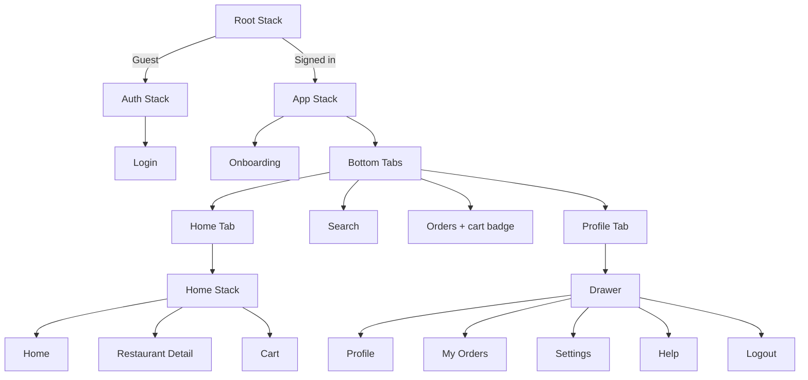

# Khana Khazana — Food Delivery App

A React Native (Expo) food delivery demo focused on **React Navigation**: nested navigators, route params, conditional auth, deep linking, tab bar visibility, drawer navigation, badges, and programmatic navigation (`navigate`, `goBack`, `replace`, `reset`).

---

## Project overview

**Khana Khazana** is a mobile-first food ordering UI built as a navigation practice project—not a production backend app.

Users can:

- Sign in with mock authentication (persisted locally)
- Complete one-time onboarding
- Browse restaurants on Home, search by name/cuisine
- Open restaurant details with passed params (`name`, `price`, `id`)
- Add items to cart, place orders, and view order history
- Use bottom tabs (Home, Search, Orders, Profile) and a profile drawer (My Orders, Settings, Help, Logout)
- Open specific screens via custom URL scheme deep links

Default demo user: **Ghazi** (`ghazi@yusuf.com`). Any password works for sign-in.

---

## Tech stack

| Layer | Technology |
|--------|------------|
| Framework | [Expo](https://expo.dev) SDK **55** |
| UI | React Native **0.83**, React **19** |
| Language | TypeScript |
| Navigation | React Navigation **7** (Stack, Bottom Tabs, Drawer) |
| Icons | `@expo/vector-icons` (Ionicons) |
| Persistence | `@react-native-async-storage/async-storage` |
| Gestures / animations | `react-native-gesture-handler`, `react-native-reanimated` |
| Deep linking | `expo-linking` + React Navigation linking config |
| Web | `react-native-web`, `react-dom` |

---

## How to run locally

### Prerequisites

- **Node.js 18+** (LTS recommended) — [Download](https://nodejs.org/)
- **npm 9+** (comes with Node.js; verify with `npm -v`)
- **Git** (for version control)
- **Windows/Mac/Linux** operating system

### Environment verification

Before starting, verify your setup:

```bash
# Check Node version (should be 18+)
node -v

# Check npm version (should be 9+)
npm -v

# Ensure you're in the FoodDeliveryApp directory
pwd  # or: cd "path/to/FoodDeliveryApp"
```

If any command fails, install or update the missing tool.

### Install and start

```bash
cd FoodDeliveryApp
npm install
npx expo start
```

Then:

- Press **`a`** — Android emulator
- Press **`i`** — iOS simulator (macOS)
- Press **`w`** — Web browser
- Scan QR code — Expo Go on a physical device

**Web (recommended after config changes):**

```bash
npm run web
```

The app opens automatically at **http://localhost:8081** with live reload enabled.

### Demo login

1. Open the app → **Login**
2. Email: `ghazi@yusuf.com` (pre-filled) — any password
3. Tap **Sign In**
4. Complete **Onboarding** once (Get Started)
5. Explore tabs and flows

### Quick start (one command)

```bash
npm install && npm run web
```

This installs dependencies and starts the web development server immediately.

### Post-installation verification

After `npm install`, verify the setup:

```bash
# Check that node_modules was created
ls node_modules/@react-navigation  # Should show multiple folders

# Verify all key dependencies installed
npm list expo react-native react-navigation

# Check for any TypeScript issues
npx tsc --noEmit  # Should complete without errors

# Test the dev server
npm run web  # Should start without errors
```

If any verification fails, see **Common errors & solutions** section.

---

## Navigation structure



### Navigator roles

| Navigator | Purpose |
|-----------|---------|
| **Root Stack** | Switches Auth vs App based on login |
| **Auth Stack** | Login screen |
| **App Stack** | Onboarding → Main app |
| **Bottom Tabs** | Home, Search, Orders, Profile |
| **Home Stack** | Home → Restaurant Detail → Cart |
| **Drawer** (inside Profile tab) | Profile, My Orders, Settings, Help |

### Key navigation behaviors

| Feature | Implementation |
|---------|----------------|
| **Params** | Home passes `id`, `name`, `price` to Restaurant Detail |
| **Hide tab bar** | Hidden on Restaurant Detail and Cart via `getFocusedRouteNameFromRoute` |
| **Orders badge** | Tab badge shows cart item count from `CartContext` |
| **Custom header** | Orange stack header with title and custom back label |
| **Onboarding** | `reset()` to Main Tabs on Get Started |
| **Checkout** | `reset()` to Home after place order |
| **Empty cart** | `replace()` to Home |
| **Logout** | Clears auth, onboarding, cart, and orders |

### Params example (Home → Restaurant Detail)

```ts
navigation.navigate('RestaurantDetail', {
  id: item.id,
  name: item.name,
  price: item.price,
});
```

---

## Deep linking setup

### Scheme

Configured in `app.json`:

```json
"scheme": "khana-khazana"
```

| File | Role |
|------|------|
| `src/navigation/linking.ts` | URL → screen mapping |
| `src/navigation/deepLink.ts` | Pending links when logged out |
| `src/navigation/navigationRef.ts` | Programmatic navigation after auth |

### Supported URLs

| URL | Destination |
|-----|-------------|
| `khana-khazana://restaurant/123` | Restaurant Detail (Spice Garden, id `123`) |
| `khana-khazana://home` | Home |
| `khana-khazana://cart` | Cart |
| `khana-khazana://search` | Search |
| `khana-khazana://orders` | Orders |
| `khana-khazana://profile` | Profile |
| `khana-khazana://login` | Login (when signed out) |
| `khana-khazana://onboarding` | Onboarding |
| `khana-khazana://my-orders` | My Orders (drawer) |
| `khana-khazana://settings` | Settings |
| `khana-khazana://help` | Help |

### Test commands

**iOS Simulator (signed in):**

```bash
xcrun simctl openurl booted "khana-khazana://restaurant/123"
```

**Android Emulator:**

```bash
adb shell am start -a android.intent.action.VIEW -d "khana-khazana://restaurant/123"
```

**Expo / dev client:**

```bash
npx uri-scheme open khana-khazana://restaurant/123 --ios
```

**Guest flow:** Opening e.g. `khana-khazana://restaurant/123` while logged out shows Login first. After sign-in and onboarding, the app navigates to the saved destination.

---

## Screenshots

### Web Access

The app is designed to be responsive and works across all platforms:

- **Web**: `npm run web` → http://localhost:8081
- **iOS Simulator**: `npx expo start` → Press `i`
- **Android Emulator**: `npx expo start` → Press `a`
- **Physical Device**: `npx expo start` → Scan QR code with Expo Go

### Key screens

1. **Login** — Email and password input with mock authentication
2. **Onboarding** — Single "Get Started" screen shown on first launch
3. **Home** — Restaurant grid with search and filter capabilities
4. **Restaurant Detail** — Menu items with pricing and restaurant info
5. **Cart** — Checkout flow with order summary
6. **Orders** — Order history and status tracking
7. **Profile** — User info and drawer navigation menu
8. **Search** — Search restaurants by name and cuisine type
9. **Settings** — App configuration and preferences
10. **Help** — Support and FAQ information

---

## Setup validation checklist

Before running the app, verify each step:

- [ ] Node.js 18+ installed: `node -v`
- [ ] npm 9+ installed: `npm -v`
- [ ] In FoodDeliveryApp directory: `pwd` shows correct path
- [ ] Dependencies installed: `ls node_modules` shows packages
- [ ] No TypeScript errors: `npx tsc --noEmit`
- [ ] App.tsx imports correctly: No module errors
- [ ] Port 8081 available: `npx kill-port 8081` (if needed)
- [ ] Browser cache cleared (for web testing)

If any step fails, refer to **Common errors & solutions** above.

---

## Error prevention guide

### During setup

1. **Always run `npm install` after cloning** — Missing dependencies cause cascading errors
2. **Use the correct directory** — Many errors stem from running commands in the wrong folder
3. **Check Node version** — Requires Node 18+ for compatibility
4. **Use `npm install --legacy-peer-deps` if needed** — Avoids peer dependency conflicts

### During development

1. **Clear cache when making config changes** — Use `npm run web -c` (includes `-c` flag)
2. **Hard-refresh browser after changes** — Ctrl+Shift+R (not just Ctrl+R)
3. **Restart Metro bundler** — Kill terminal (Ctrl+C) and restart if you see Metro errors
4. **Check file imports** — Typos in import paths cause "Cannot find module" errors
5. **Verify AsyncStorage setup** — Required for login persistence; test with browser DevTools

### During testing

1. **Validate deep links** — Test with mock data ids first (e.g., `123`, `124`)
2. **Check app state** — Use React DevTools or browser console to inspect state
3. **Test all platforms** — Web, iOS, and Android may behave differently
4. **Clear app data between tests** — Logout to reset state, or clear AsyncStorage

### Deployment preparation

1. **Run TypeScript check** — `npx tsc --noEmit`
2. **Test deep linking on all platforms** — Schemes must be identical
3. **Verify all environment paths** — No hardcoded absolute paths
4. **Review console warnings** — Fix deprecation warnings before production

---

## Testing

### Test scenarios

1. **First launch** → Login → Onboarding → Home
2. **Add to cart** → Cart shows badge on Orders tab
3. **Deep link while logged out** → Login required first, then navigates to destination
4. **Drawer navigation** → Accessible from Profile tab
5. **Logout** → Clears all state and returns to Login
6. **Search functionality** → Filter restaurants by name/cuisine
7. **Responsive design** → Works on mobile (Expo Go), tablet, and desktop (web)

### Troubleshooting

| Error | Cause | Solution |
|-------|-------|----------|
| `'expo' is not recognized` | npm packages not installed | Run `npm install` in the project directory |
| `Cannot find module '@expo/vector-icons'` | Incomplete dependency installation | Run `npm install` or `npm install --legacy-peer-deps` |
| `Metro bundler crashes` | Cache corruption or out-of-date build | Kill terminal (Ctrl+C), then run `npm run web -c` |
| `AsyncStorage returns null` | Local storage cleared or device permissions denied | On web: Check browser local storage; On mobile: Check app permissions |
| `Deep link not working` | Restaurant id doesn't exist or user not signed in | Verify id matches mock data (e.g., `123` for Spice Garden); ensure you're logged in |
| `Web version not updating after changes` | Browser cache or Metro cache issue | Hard refresh (Ctrl+Shift+R) or restart with `npm run web -c` |
| `Port 8081 already in use` | Another process using the port | Kill the process: `npx kill-port 8081` or change port with `npx expo start --web --port 3000` |
| `TypeError: Cannot read property 'navigate'` | Navigation ref not initialized | Ensure `navigationRef` is properly connected in `RootNavigator` |
| `Package.json errors after npm install` | Dependency version conflicts | Run `npm install --legacy-peer-deps` or `npm audit fix` |
| `ENOENT: no such file or directory` | Running npm command from wrong directory | Verify current directory with `pwd`, navigate to FoodDeliveryApp folder |

### Common errors & solutions

**Error 1: Module not found after `npm install`**
```
Module not found: Can't resolve '@react-navigation/native'
```
**Fix:** Run `npm install` again or use `npm install --legacy-peer-deps`

**Error 2: Build fails on web**
```
TypeError: Cannot find module './src/navigation/linking'
```
**Fix:** Ensure all imports use correct relative paths; check TypeScript compilation

**Error 3: AsyncStorage warnings in console**
```
Warning: AsyncStorage has been extracted from react-native core
```
**Fix:** This is informational; ensure `@react-native-async-storage/async-storage` is installed

**Error 4: Routing loops or infinite navigation**
```
Navigation state keeps resetting
```
**Fix:** Check deep linking configuration in `linking.ts`; avoid circular route references

---

## Assumptions

1. **Mock auth** — No real API; any password works; session stored in AsyncStorage.
2. **Mock data** — Restaurants and orders are local constants, not fetched from a server.
3. **Single demo user** — Display name defaults to **Ghazi**; email comes from the login field.
4. **Onboarding** — Shown once per install until completed; logout resets the onboarding flag.
5. **Orders** — “Place order” saves to local storage and clears the cart; no payment or delivery API.
6. **Deep links** — Restaurant `id` in the URL is matched to mock data (e.g. `123` → Spice Garden); `name` / `price` are resolved from mock data when omitted.
7. **Platform scope** — Built and tested with Expo Go, simulators, and web; production native builds may need extra linking configuration.
8. **Web** — Supported via `react-native-web`; full-height root layout is applied for correct flex behavior.
9. **Assignment focus** — Navigation patterns are the primary goal, not production UI or backend integration.
10. **No real payments** — Checkout is a UI-only flow.
11. **Persistent state** — Login, onboarding, cart, and orders are persisted in AsyncStorage and survive app restarts.
12. **Role of Context** — `AuthContext`, `CartContext`, and `OrdersContext` manage global state; no Redux or external state management.

---

## Known limitations & workarounds

| Limitation | Impact | Workaround |
|-----------|--------|-----------|
| Mock data only | No real restaurant data | Add Firebase/backend integration for production |
| LocalStorage only | Data lost if app is cleared | Implement cloud sync for persistence |
| No payment processing | Checkout is UI-only | Integrate Stripe/PayPal for real transactions |
| Limited error handling | App may crash on unexpected input | Add try-catch blocks and error boundaries |
| No notification system | Users don't get order updates | Add push notifications with Expo Notifications |
| Single user context | No multi-user support | Extend AuthContext for multiple accounts |
| No offline mode | App requires internet | Implement offline caching with Redux Persist |
| Web performance | Large bundles on slow networks | Implement code splitting and lazy loading |

---

## Support & debug resources

### Debug tools

- **VS Code Debugger** — Debug TypeScript with breakpoints and step-through
- **React DevTools** — Inspect component hierarchy and state
- **Expo DevTools** — Built into Metro; access via terminal commands
- **Browser DevTools** (Web) — Console, Network, Local Storage tabs
- **Android/iOS DevTools** — Platform-specific debugging with Xcode/Android Studio

### Debug commands

```bash
# Clear all caches (use if Metro is unresponsive)
npm run web -c

# Check for TypeScript errors
npx tsc --noEmit

# View npm debug logs
cat ~/.npm/_logs/*-debug.log

# Kill process on port 8081 (if stuck)
npx kill-port 8081

# Clear AsyncStorage (web browser console)
localStorage.clear()

# View app state (React DevTools)
$r.props.navigation.getState()
```

### Getting help

1. **Check console first** — Many errors logged with solutions
2. **Search the code** — Look for similar patterns in existing screens
3. **Review commit history** — Understand how features were implemented
4. **Test in isolation** — Disable features to isolate the problem
5. **Consult dependencies** — Check React Navigation and Expo docs

### Resources

- [React Navigation Docs](https://reactnavigation.org/)
- [Expo Docs](https://docs.expo.dev/)
- [React Native Docs](https://reactnative.dev/)
- [TypeScript Handbook](https://www.typescriptlang.org/docs/)
- [Deep Linking Guide](https://reactnavigation.org/docs/deep-linking/)

---

## Project structure

```
FoodDeliveryApp/
├── App.tsx
├── app.json
├── index.ts
├── babel.config.js
└── src/
    ├── components/       CustomHeader, CustomDrawerContent, PrimaryButton, …
    ├── constants/        theme.ts, restaurants.ts
    ├── context/          AuthContext, CartContext, OrdersContext
    ├── navigation/       RootNavigator, stacks, tabs, drawer, linking, deepLink
    ├── screens/          Login, Onboarding, Home, Search, Cart, Orders, …
    ├── types/            navigation param lists
    └── utils/            setupWeb.ts
```

---

## License

Private / educational use (assignment project).
