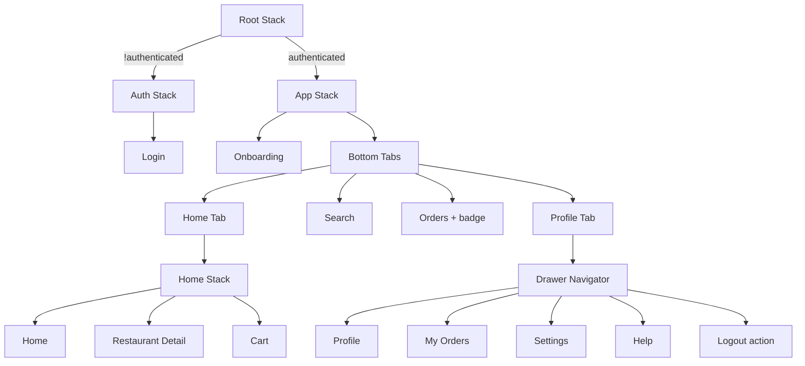

# Food Delivery App

Expo React Native app demonstrating **React Navigation** patterns: nested navigators, params, auth flow, deep linking, tab bar visibility, drawer, badges, and programmatic navigation.

## Quick start

```bash
cd FoodDeliveryApp
npm install
npx expo start
```

Sign in with any email/password (mock auth persists via AsyncStorage). Complete onboarding once, then explore the main app.

## Navigation structure



**Visual diagram (TLDraw):** [Open navigation diagram on TLDraw](https://www.tldraw.com/r/v1?d=food-delivery-navigation)

## Flows

| Flow | Screens | Navigation APIs |
|------|---------|-----------------|
| Onboarding | Onboarding → Main Tabs | `reset()` on Get Started |
| Restaurant | Home → Detail → Cart | `navigate()` with params, `goBack()`, `replace()` |
| Auth | Login ↔ Main app | Conditional root; persisted with AsyncStorage |
| Checkout | Cart → Home | `reset()` |
| Logout | Drawer | Clears auth + onboarding keys |

### Params (Home → Restaurant Detail)

```ts
navigation.navigate('RestaurantDetail', {
  id: item.id,
  name: item.name,
  price: item.price,
});
```

### Hide tab bar

`MainTabs` uses `getFocusedRouteNameFromRoute` to hide the tab bar on `RestaurantDetail` and `Cart`.

### Orders badge

`tabBarBadge` on the Orders tab reflects `CartContext` item count.

### Custom stack header

`CustomHeader` shows orange header, centered title, and custom back label (e.g. “Home”).

## Deep linking

Scheme: `khana-khazana` (see `app.json` → `expo.scheme`).

| URL | Opens |
|-----|--------|
| `khana-khazana://restaurant/123` | Restaurant Detail (Spice Garden) |
| `khana-khazana://home` | Home |
| `khana-khazana://cart` | Cart |
| `khana-khazana://search` | Search |
| `khana-khazana://orders` | Orders |
| `khana-khazana://profile` | Profile |
| `khana-khazana://login` | Login (when signed out) |

**Test (authenticated):**

```bash
# iOS Simulator
xcrun simctl openurl booted "khana-khazana://restaurant/123"

# Android Emulator
adb shell am start -a android.intent.action.VIEW -d "khana-khazana://restaurant/123"
```

With Expo Go / dev build:

```bash
npx uri-scheme open khana-khazana://restaurant/123 --ios
```

> If you open a deep link while signed out (e.g. `khana-khazana://restaurant/123`), you’ll land on Login first. After sign-in and onboarding, the app opens the linked screen automatically.

## Project layout

```
src/
  components/     CustomHeader, CustomDrawerContent
  constants/      theme, restaurants mock data
  context/        AuthContext, CartContext, OrdersContext
  navigation/     Root, Auth, App, Tabs, Home stack, Drawer, linking, deepLink
  screens/        All UI screens
  types/          navigation param lists
```

## Dependencies

- `@react-navigation/native`, `stack`, `bottom-tabs`, `drawer`
- `@react-native-async-storage/async-storage`
- `react-native-gesture-handler`, `react-native-reanimated`, `react-native-screens`
- `expo-linking`
