# Khana Khazana — Food Delivery App

A React Native (Expo) food delivery demo focused on **React Navigation**: nested navigators, route params, conditional auth, deep linking, tab bar visibility, drawer navigation, badges, and programmatic navigation (`navigate`, `goBack`, `replace`, `reset`).

---

## Project overview

**Khana Khazana** is a mobile-first food ordering UI built as a navigation practice project—not a production backend app.

Users can:

- Sign in with mock authentication (persisted locally)
- Complete one-time onboarding
- Browse restaurants on Home, search by name/cuisine
- Open restaurant details with passed params (`name`, `price`, `id`)
- Add items to cart, place orders, and view order history
- Use bottom tabs (Home, Search, Orders, Profile) and a profile drawer (My Orders, Settings, Help, Logout)
- Open specific screens via custom URL scheme deep links

Default demo user: **Ghazi** (`ghazi@yusuf.com`). Any password works for sign-in.

---

## Tech stack

| Layer | Technology |
|--------|------------|
| Framework | [Expo](https://expo.dev) SDK **55** |
| UI | React Native **0.83**, React **19** |
| Language | TypeScript |
| Navigation | React Navigation **7** (Stack, Bottom Tabs, Drawer) |
| Icons | `@expo/vector-icons` (Ionicons) |
| Persistence | `@react-native-async-storage/async-storage` |
| Gestures / animations | `react-native-gesture-handler`, `react-native-reanimated` |
| Deep linking | `expo-linking` + React Navigation linking config |
| Web | `react-native-web`, `react-dom` |

---

## How to run locally

### Prerequisites

- Node.js 18+ (LTS recommended)
- npm (or yarn / pnpm)

### Install and start

```bash
cd FoodDeliveryApp
npm install
npx expo start
```

Then:

- Press **`a`** — Android emulator
- Press **`i`** — iOS simulator (macOS)
- Press **`w`** — Web browser
- Scan QR code — Expo Go on a physical device

**Web (recommended after config changes):**

```bash
npx expo start --web -c
```

### Demo login

1. Open the app → **Login**
2. Email: `ghazi@yusuf.com` (pre-filled) — any password
3. Tap **Sign In**
4. Complete **Onboarding** once (Get Started)
5. Explore tabs and flows

---

## Navigation structure

```mermaid
flowchart TB
  Root[Root Stack]
  Root -->|Guest| Auth[Auth Stack]
  Root -->|Signed in| App[App Stack]
  Auth --> Login[Login]
  App --> Onboarding[Onboarding]
  App --> Tabs[Bottom Tabs]
  Tabs --> HomeTab[Home Tab]
  Tabs --> Search[Search]
  Tabs --> Orders[Orders + cart badge]
  Tabs --> ProfileTab[Profile Tab]
  HomeTab --> HomeStack[Home Stack]
  HomeStack --> Home[Home]
  HomeStack --> Detail[Restaurant Detail]
  HomeStack --> Cart[Cart]
  ProfileTab --> Drawer[Drawer]
  Drawer --> Profile[Profile]
  Drawer --> MyOrders[My Orders]
  Drawer --> Settings[Settings]
  Drawer --> Help[Help]
  Drawer --> Logout[Logout]
```



### Navigator roles

| Navigator | Purpose |
|-----------|---------|
| **Root Stack** | Switches Auth vs App based on login |
| **Auth Stack** | Login screen |
| **App Stack** | Onboarding → Main app |
| **Bottom Tabs** | Home, Search, Orders, Profile |
| **Home Stack** | Home → Restaurant Detail → Cart |
| **Drawer** (inside Profile tab) | Profile, My Orders, Settings, Help |

### Key navigation behaviors

| Feature | Implementation |
|---------|----------------|
| **Params** | Home passes `id`, `name`, `price` to Restaurant Detail |
| **Hide tab bar** | Hidden on Restaurant Detail and Cart via `getFocusedRouteNameFromRoute` |
| **Orders badge** | Tab badge shows cart item count from `CartContext` |
| **Custom header** | Orange stack header with title and custom back label |
| **Onboarding** | `reset()` to Main Tabs on Get Started |
| **Checkout** | `reset()` to Home after place order |
| **Empty cart** | `replace()` to Home |
| **Logout** | Clears auth, onboarding, cart, and orders |

### Params example (Home → Restaurant Detail)

```ts
navigation.navigate('RestaurantDetail', {
  id: item.id,
  name: item.name,
  price: item.price,
});
```

---

## Deep linking setup

### Scheme

Configured in `app.json`:

```json
"scheme": "khana-khazana"
```

| File | Role |
|------|------|
| `src/navigation/linking.ts` | URL → screen mapping |
| `src/navigation/deepLink.ts` | Pending links when logged out |
| `src/navigation/navigationRef.ts` | Programmatic navigation after auth |

### Supported URLs

| URL | Destination |
|-----|-------------|
| `khana-khazana://restaurant/123` | Restaurant Detail (Spice Garden, id `123`) |
| `khana-khazana://home` | Home |
| `khana-khazana://cart` | Cart |
| `khana-khazana://search` | Search |
| `khana-khazana://orders` | Orders |
| `khana-khazana://profile` | Profile |
| `khana-khazana://login` | Login (when signed out) |
| `khana-khazana://onboarding` | Onboarding |
| `khana-khazana://my-orders` | My Orders (drawer) |
| `khana-khazana://settings` | Settings |
| `khana-khazana://help` | Help |

### Test commands

**iOS Simulator (signed in):**

```bash
xcrun simctl openurl booted "khana-khazana://restaurant/123"
```

**Android Emulator:**

```bash
adb shell am start -a android.intent.action.VIEW -d "khana-khazana://restaurant/123"
```

**Expo / dev client:**

```bash
npx uri-scheme open khana-khazana://restaurant/123 --ios
```

**Guest flow:** Opening e.g. `khana-khazana://restaurant/123` while logged out shows Login first. After sign-in and onboarding, the app navigates to the saved destination.

---

## Screenshots


## Assumptions

1. **Mock auth** — No real API; any password works; session stored in AsyncStorage.
2. **Mock data** — Restaurants and orders are local constants, not fetched from a server.
3. **Single demo user** — Display name defaults to **Ghazi**; email comes from the login field.
4. **Onboarding** — Shown once per install until completed; logout resets the onboarding flag.
5. **Orders** — “Place order” saves to local storage and clears the cart; no payment or delivery API.
6. **Deep links** — Restaurant `id` in the URL is matched to mock data (e.g. `123` → Spice Garden); `name` / `price` are resolved from mock data when omitted.
7. **Platform scope** — Built and tested with Expo Go, simulators, and web; production native builds may need extra linking configuration.
8. **Web** — Supported via `react-native-web`; full-height root layout is applied for correct flex behavior.
9. **Assignment focus** — Navigation patterns are the primary goal, not production UI or backend integration.
10. **No real payments** — Checkout is a UI-only flow.

---

## Project structure

```
FoodDeliveryApp/
├── App.tsx
├── app.json
├── index.ts
├── babel.config.js
└── src/
    ├── components/       CustomHeader, CustomDrawerContent, PrimaryButton, …
    ├── constants/        theme.ts, restaurants.ts
    ├── context/          AuthContext, CartContext, OrdersContext
    ├── navigation/       RootNavigator, stacks, tabs, drawer, linking, deepLink
    ├── screens/          Login, Onboarding, Home, Search, Cart, Orders, …
    ├── types/            navigation param lists
    └── utils/            setupWeb.ts
```

---

## License

Private / educational use (assignment project).
